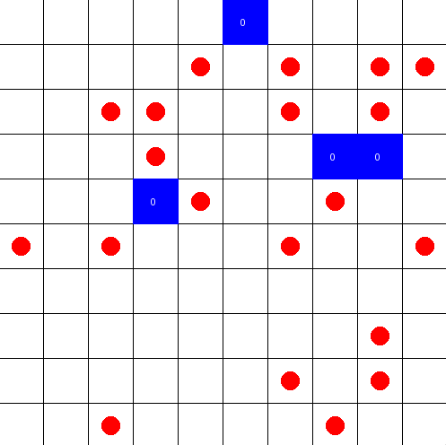

# fruit-farm
# Autonomous Agents & Multi-Agent Systems Project

### About:
This environment consists of a two dimensional grid, with apples placed on it (represented by red circles), and each square of the grid can only have at most one apple. The initial state of the environment has a set number of apples that are placed on the grid randomly. In subsequent iterations of time these apples propagate to near empty squares with a predetermined chance. The environment can also suffer from natural disasters, an event that makes it so that every apple currently on the grid has a 50% chance of disappearing, and this has a set chance of happening every iteration.

### Quickstart:

1. Clone the repo

    $ git clone https://github.com/DiFarGon/fruit-farm.git
    
    $ cd fruit-farm

2. Create virtual environment (tested with python 3.8.2)

    $ python3 -m venv venv
    
    $ source venv/bin/activate

3. Install dependencies (numpy, ma-gym, matplotlib)

    $ pip install -r requirements.txt

4. Run project
    In the terminal:
    
    $ python fruit-farm.py --grid_shape 10 --n_agents 4 --n_apples 20 --disaster_probability 0.0 --growth_rate 1

   Or with the exe located in scene1/scene1-fruitfarm.exe which contains an example of scene 1 but with 5 episodes per agent type.

